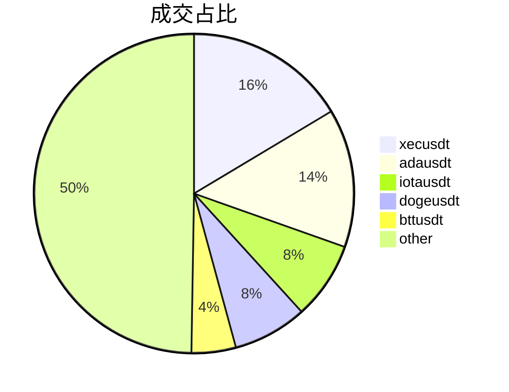
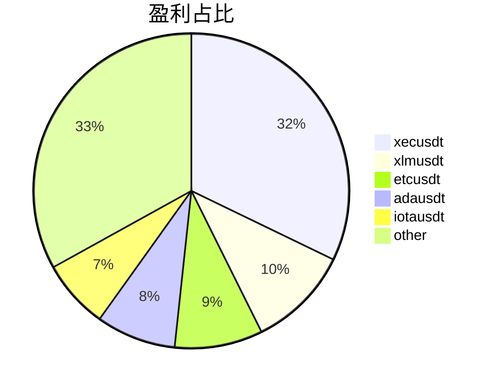

# 期现套利策略介绍及实现

彭沛东 
2021-09-24

---

# 大纲
## 1. 期现关系
 

## 2. 策略介绍
 

## 3. 策略实现

---

# 现货

## 现货:  通常指实物
- 如农作物大豆、玉米
- 如数字货币BTC、ETH

 

## 现货交易:  一般以一手交钱一手交货或者以物换物的方式
 

- 比如 10RMB 买2斤大豆、50000USD 买 1BTC
- 比如2斤大豆换3斤玉米、100ETH 换 7BTC

---

# 期货

## 期货是期货合约的简称，通常指基于某种现货标的签订的跨时间的标准化的买卖合约
如大连商品交易所的**b2111**合约详情如下：
- 标的为黄大豆2号
- 交割时间为2021年11月份第13个交易日
- 交易单位为10吨/手
- 最小保证金为合约价值的5%

如OKEx的**BTCUSDT当季1231**合约详情如下：
- 标的为BTC
- 交割时间为2021年12月31日
- 交易单位为0.01BTC
- 最大杠杆倍数为125倍

<!--
对比传统金融和数字货币：
- 数字货币7*24小时都是交易日
- 起始交易额更低
- 杠杆范围更大
-->

---

# 期货交易

## 方向

- 看涨 --> 做多
- 看跌 --> 做空

## 保证金制度

根据合约价格，按一定比率交纳少量资金作为履行合约的财力担保，即可参与合约的买卖

假如当前BTC价格为50000U/BTC，100倍杠杆做多1BTC，则初始保证金为500U
- 价格涨1%即50500U，盈利100%即500U
- 价格跌1%即49500U，亏损100%即500U

---

# 期现关系

## 交割合约

临近交割日时，市场上的合约价格会自然向现货价格靠拢，最终会趋于一致。
不一致则存在套利空间，套利者可以进行套利。

## 永续合约

永续合约需要通过“资金费用机制”来让合约价格锚定现货价格

当资金费率为正数时，多头向空头支付资金费用；如果资金费率为负，则空头向多头用户支付费用。

---

# 策略逻辑

- 当期货价格高于现货且价差较大时（价差记为为 S1）买入现货同时做空等量期货
- 后续当价差缩小时（价差记为 S2），卖出现货同时平空期货
- 假设交易手续费为F，则盈亏为：S1 - S2 - F

 

XEC-USDT 期现价格快照（价差 **9%**、资金费率 **+0.375%**）

---

# 量化策略

## 程序 = 数据 + 算法
 

## 量化策略 ∈ 程序
 
 

 
 

## 量化策略 = 数据 + 算法
- 数据：通过交易所接口获取的市场价格数据、账户余额数据等
- 算法：通过交易所接口实现上文说到的策略逻辑

---

# 策略实现

##  Order
订单，交易的基本单位，包含ID、价格、数量、成交状态等信息

##  Proposal
提案，策略的基本单位，基于输入数据判断是否开仓、平仓来创建Order，并根据Order的状态来切换自己的状态

一般情况下1个Proposal整个周期会建立4个Order： 期货开仓/现货开仓、期货平仓/现货平仓

---

# 策略流程图

---

# 策略探讨
- 使用限价单还是市价单
- 使用限价单的情况部分成交该如何处理
- 如何处理服务端500错误
- 下单网络超时实际却成交了
- 期货价格高于现货但资金费率为负
- 杠杆和仓位管理
- AMM市场特殊的收费模式

---

# 策略结果

---

# 策略结果

---

# 参考

- [大连商品交易所黄大豆2号期货合约](http://www.dce.com.cn/dalianshangpin/sspz/487153/487157/6040854/index.html)
- [OKEx交割合约介绍](https://www.okex.com/support/hc/zh-cn/articles/360035845611-1-USDT%E4%BF%9D%E8%AF%81%E9%87%91%E4%BA%A4%E5%89%B2%E5%90%88%E7%BA%A6%E7%AE%80%E4%BB%8B)
- [OKEx永续合约介绍](https://www.okex.com/support/hc/zh-cn/articles/360020149012-1-%E6%B0%B8%E7%BB%AD%E5%90%88%E7%BA%A6%E7%AE%80%E4%BB%8B)
- [派网期现套利策略](https://www.pionex.com/blog/zh-cn/arbitrage-cn/)
- [hummingbot期现套利策略](https://docs.hummingbot.io/strategies/spot-perpetual-arbitrage/)
